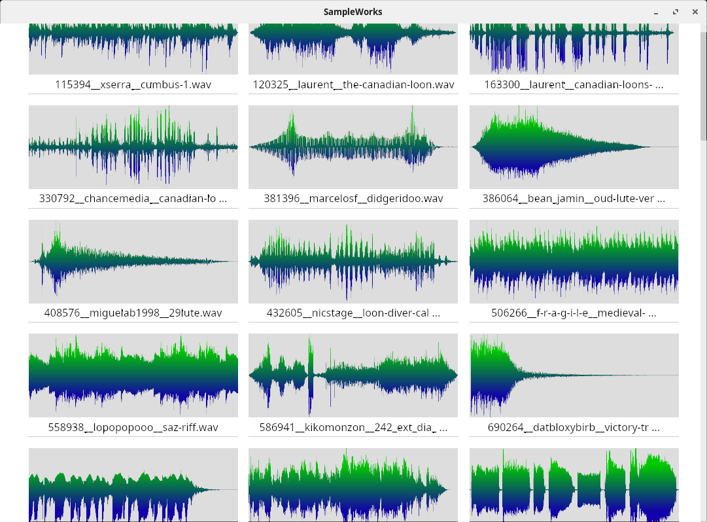

# SampleWorks

SampleWorks is a sound sample manager inspired by the concept of a light table.
The main objective of the project is to facilitate a very efficient workflow
when organizing and processing collections of samples.

**IMPORTANT: the current version is just a demo!**

## Running the demo

1. Clone the repo and `cargo run`. If that's not enough info for you, please
be patient - we're just getting started here!

2. In addition to compiling a bunch of code, SampleWorks needs to generate
waveform images for 59 audio samples. It's pretty slow in debug mode.

3. Once the GUI comes up, you can: (1) click on a waveform image to play the
corresponding sound; (2) stop playback by clicking again; or (3) click on a
different image to play a different sound.

*Please note that this program has only been tested on my own Manjaro Linux
system. Let me know if it doesn't work for you!*

## Features planned for v1.0

* Quick A/B comparisons

* An organizer window for sorting and grouping related samples

* Comprehensive metadata management. Metadata will be used for filtering and
sorting, and can be set through:
  - extracting embedded metadata from files
  - automated analysis of audio content
  - tagging of individual files or groups of files by the user

* Automated export of sample packs, ensuring consistency and conformance
to the requirements of the target system or device (e.g. maximum length
or file size, file format, stereo or mono, etc.)

* The ability to extract and process regions of a source file. So, for
example, if you have a recording that includes multiple drum hits, you
will be able to select a region of the source file with your mouse, apply
changes to just that region, and eventually export it as a new sample.

* Some form of editing/filtering capability (but see Open Questions).

## Open questions

* Should SampleWorks have its own sound editing/filtering capabilities? I do
not want to reinvent the wheel, so it would be nice to leverage an existing
sound editor such as Audacity, but I'm not sure this can be done in a way that
supports the efficient workflow that I'm aiming for.

* What, if anything, should be the relationship between SampleWorks and other
audio production software such as DAWs? Does it make sense to have a plugin
version of SW?

* Is it feasible to generate waveform images that use color to distinguish
different pitches? Or should we maybe use spectrograms?

* How much work should we put into analysis tools? For example, it would be
possible and maybe desirable to do a visual comparison between the waveforms
or spectrograms of two similar samples. Is that worth the extra effort, or
should we just focus on listening?

* What's the best way to manage in-process sound objects? E.g. if the user
extracts a region from a source file, it becomes its own object in the GUI.
If that object is cloned (in order, for example, to compare how two different
FX plugins affect the sound), then another object is created. So a medium-sized
project can potentially have hundreds of sound objects, some of which may be
duplicates. From the POV of storage and memory efficiency, it would be best
to represent each object as a reference to an audio source + changes, but at
some point a new audio file should be saved to disk, for two reasons: (1) to
prevent discrepancies between the audio referenced in a project and that which
is saved on disk, and (2) to preserve content in case of a crash.

* Given that the objects to be displayed will include both sound files on disk,
and derived objects, consisting of files or regions of files with modifications
applied, what is the best way to assign object IDs?

